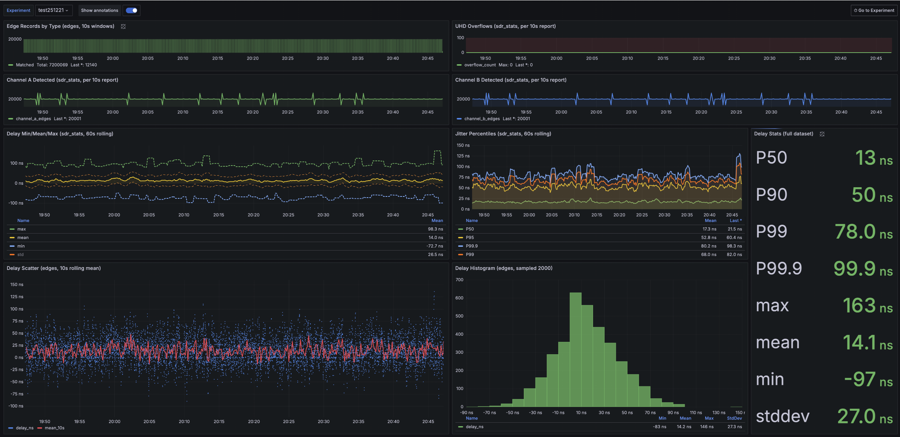

FTS can be used to build synchronized high-precision timing network using Wi-Fi FTM (Fine Timing Measurement) protocol, supported by some ESP32 chips (S3, etc) out of the box.

FTS delivers two main components:
 * **Clock Relationship Model**: Slaves build and maintain a (linear regression based) model of relationships. This model can be used to translate between the local and master's clocks.
 * **Disciplined Timer**: Slaves fine-tunes the period of their local timers to make it fire in sync with the master and, by extension, with in sync with each other.

Full source code and README.md with **build instructions** are in [Github repo](https://github.com/abbbe/fts).

Along with the very first release I have published [full technical implementation details](https://github.com/abbbe/fts/blob/main/docs/fts-presa-20251203.pdf) in  and a small [demo on Reddit](https://www.reddit.com/r/embedded/comments/1pbp0az/).

Since then I have prepared a new modular test rig, based on a lab grade Software Defined Radios and TIG stack, to collect and visualize telemetry. Couple images, just to give you an idea:

I am using this new setup to see how FTS behaves when it is **pushed to the limits**:
* distance and walls: no line of sight, signal attenuation, noise, packet loss and jitter,
* saturate wifi channel: even more FTM packet loss.