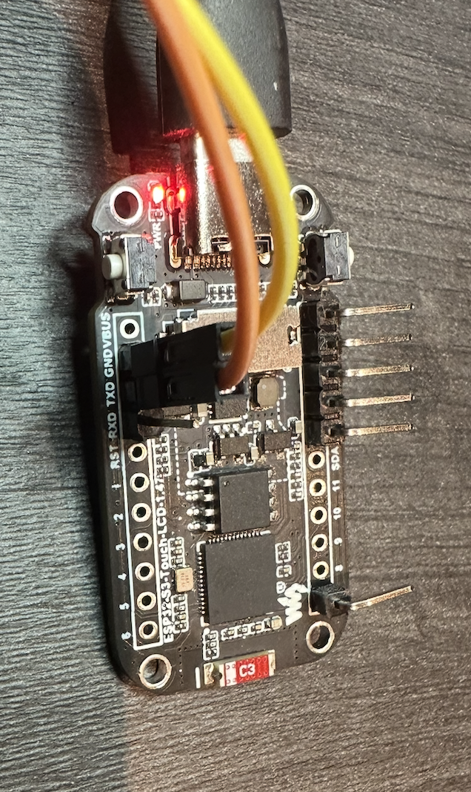
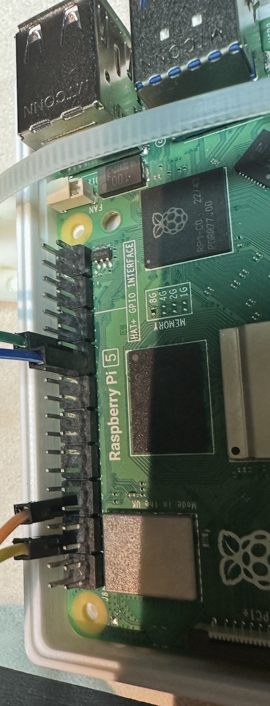
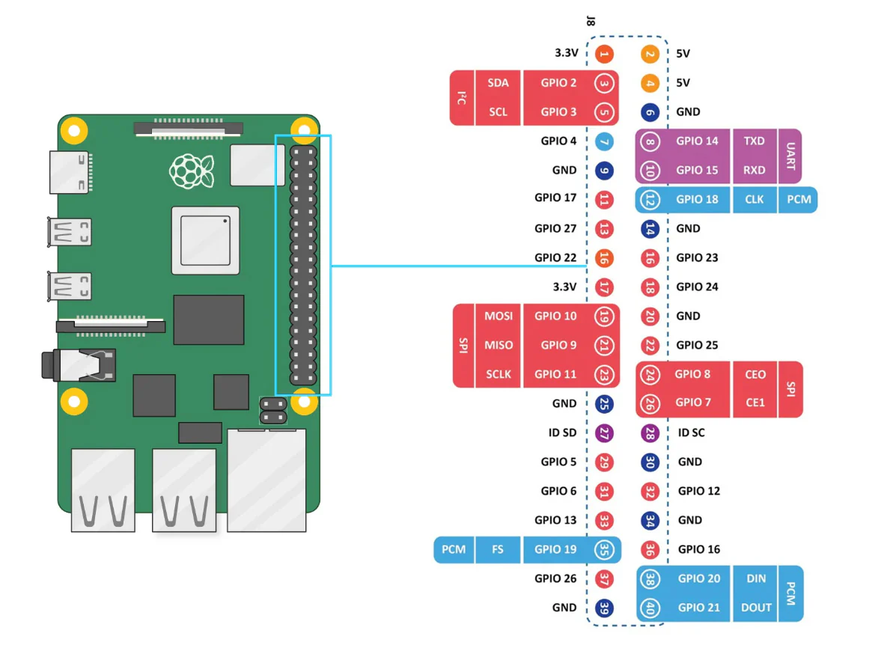

# Backplane

## Table of Contents
- TOC
{:toc}

## Introduction

This page describes the backplane connectivity, used for test and development. It includes:
* USB OTG port of ESP32 boards is connected to Raspberry Pi (master) or shuttle (slaves). They can be used to flash the devices.
* **USBIP Passthrough** is used to make master's serial port accessible from shuttle pc, so we can flash devices from one place.
* **ESP32 secondary serial ports** (at least the TX0) can be connected to serial port of Raspberry Pi. This is used for troubleshooting.
* All ESP32 S3 devices implement **USB NCM**. When plugged into a Linux host they act as a USB-connected Ethernet station. This link is used to send MQTT telemetry to TIG stack.

## USBIP Passthrough

Can be used to pass through the ports between different hosts.

On Raspberry Pi (where the device is attached to):
```bash
sudo modprobe usbip-host
sudo usbipd -D
sudo usbip bind -b 3-2
```

On minishuttle (where the development tools run):
```bash
sudo usbip attach -r rpi5b.local -b 3-2
```

## ESP32 Secondary Serial Ports
### Master

* BLUE: GND
* GREEN: TX (from Master towards RPI5)


### Slave

* YELLOW: GND
* ORANGE: TX (from Slave to RPI)



### RPI side



Slave: /dev/ttyAMA0:
* ORANGE: pin 10 (RX from Slave)
* Unused: pin 8 (TX to Slave)
* YELLOW: pin 6 (GND)

Master /dev/ttyAMA1:
* GREEN: pin 28 (RX from Master)
* Unused: pin 27 (TX to Master)
* BLUE: pin 25 (GND)

Must enable 2nd serial port:
```diff
abb@raspberrypi:~ $ diff -u /boot/firmware/config.txt- /boot/firmware/config.txt
--- /boot/firmware/config.txt-	2025-12-28 00:27:42.000000000 +0100
+++ /boot/firmware/config.txt	2025-12-28 00:43:18.000000000 +0100
@@ -50,3 +50,5 @@

 [all]
 dtparam=uart0=on
+enable_uart=1
+dtoverlay=uart1
```

This should result in the following pin configuration:
```text
abb@raspberrypi:~ $ pinctrl -p | grep -E '(RX|TX)'
 8: a4    pn | hi // GPIO14 = TXD0
10: a4    pu | hi // GPIO15 = RXD0
27: a2    pn | hi // GPIO0 = TXD1
28: a2    pu | hi // GPIO1 = RXD1
```

The pinout of Raspberry Pi 5:



To use:
```bash
sudo minicom -b 115200 -D /dev/ttyAMA0 -C log0
```

## USB NCM

All ESP32 S3 devices implement USB NCM, if CONFIG_FTS_MODE_USB_NCM is set. When plugged into a Linux host they act as a USB-connected Ethernet station.

## Linux Bridge Configuration

Linux host acts as a bridge and DHCP server for them:
```yaml
network:
  version: 2
  renderer: networkd

  ethernets:
    # Seeed XIAO S3 Sense 1
    enxb8f862f9f308:
      dhcp4: false
      optional: true

    # Waveshare
    enx1020ba466b28:
      dhcp4: false
      optional: true

    enx1020ba466b98:
      dhcp4: false
      optional: true

  bridges:
    br1:
      interfaces: [enxb8f862f9f308, enx1020ba466b28, enx1020ba466b98]
      dhcp4: false
      addresses: [192.168.7.1/24]
```

```bash
dnsmasq --interface=br1 --bind-interfaces --dhcp-range=192.168.7.100,192.168.7.110,12h --port=0
```

## Known Issues

For some reason bridging into LAN is not working, might have something to do with:
* the fact docker runs on Linux and somehow screws up the bridging process,
* or the fact both ESP32 and Linux consider MAC address of USB NCM adapter as their own,
* or a bug in ESP32 DHCP client firmware

The last one is the most likely, because if we activate debug there we see DHCP offer makes its way to ESP32 but it ignores it for some reason. So have to plug into a dedicated bridge and run local DHCP server there.

## Workaround for Raspberry Pi

For rPi need to ROUTE/MASQUERADE (TODO) or pass through:
```bash
socat -v TCP4-LISTEN:1883,reuseaddr,fork TCP4:192.168.129.206:1883
```

## MQTT

Static broker URL configured at build time (`CONFIG_FTS_MQTT_BROKER_URI`).
Works in all modes - broker can be on master's network, external AP, or via USB uplink.
