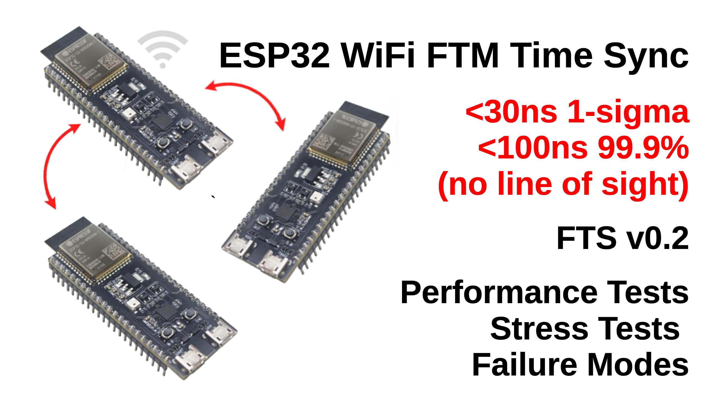
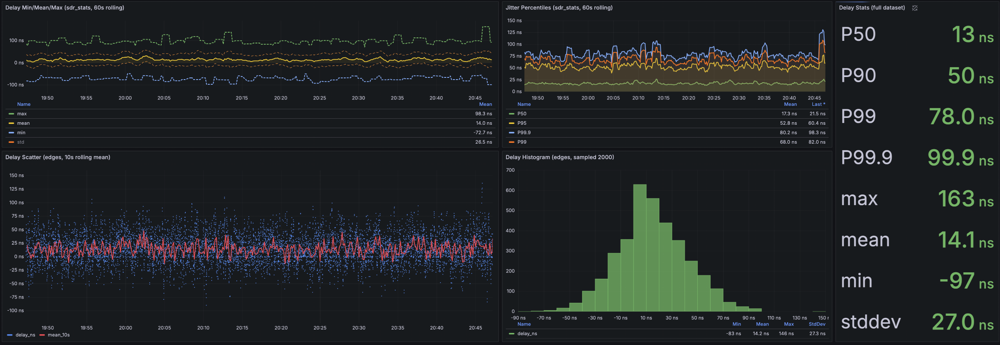
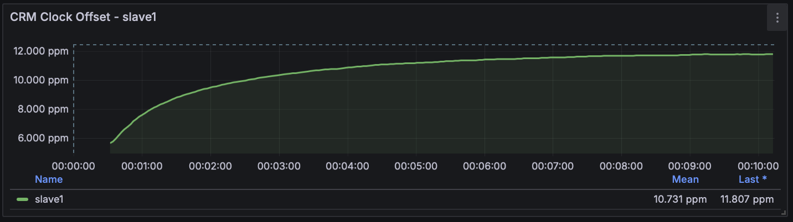
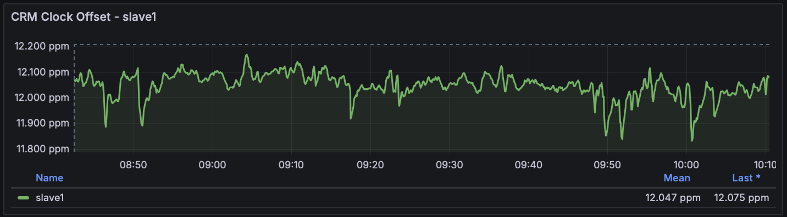
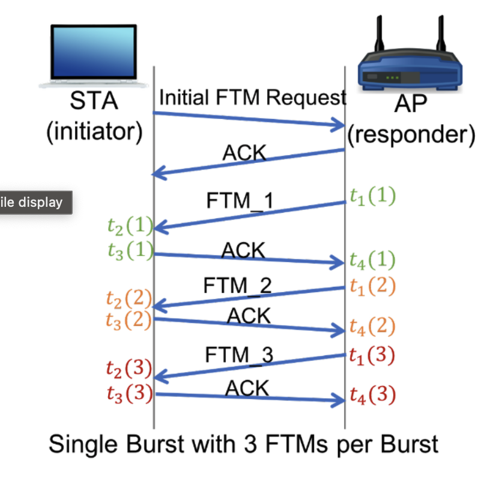
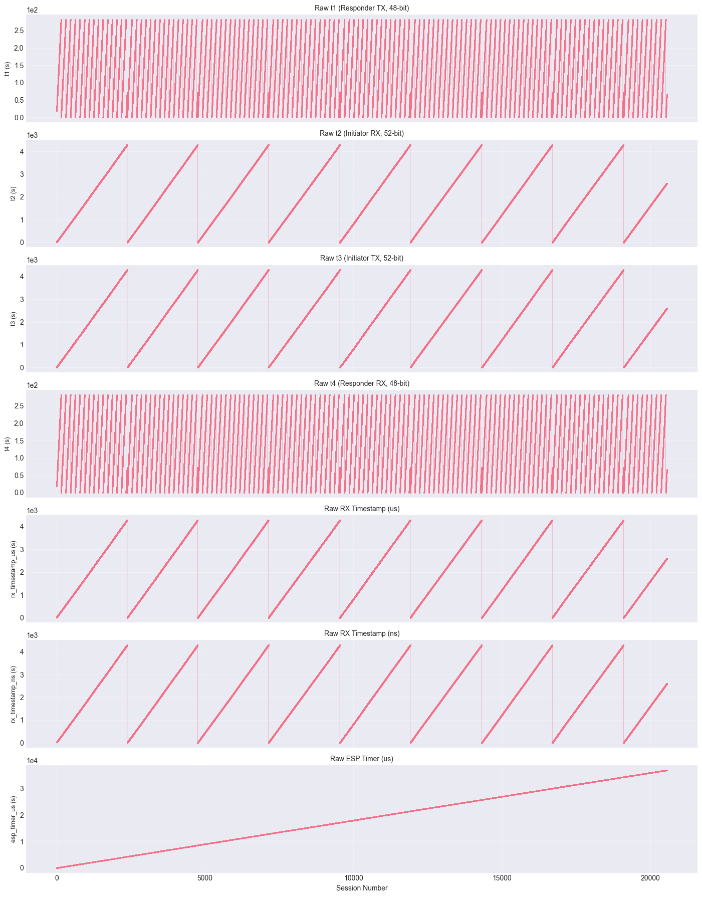
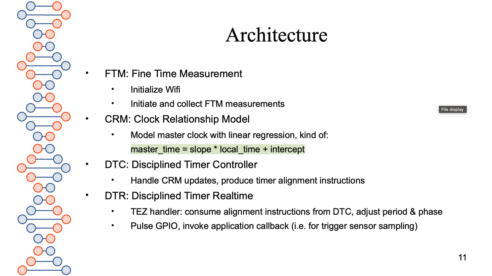
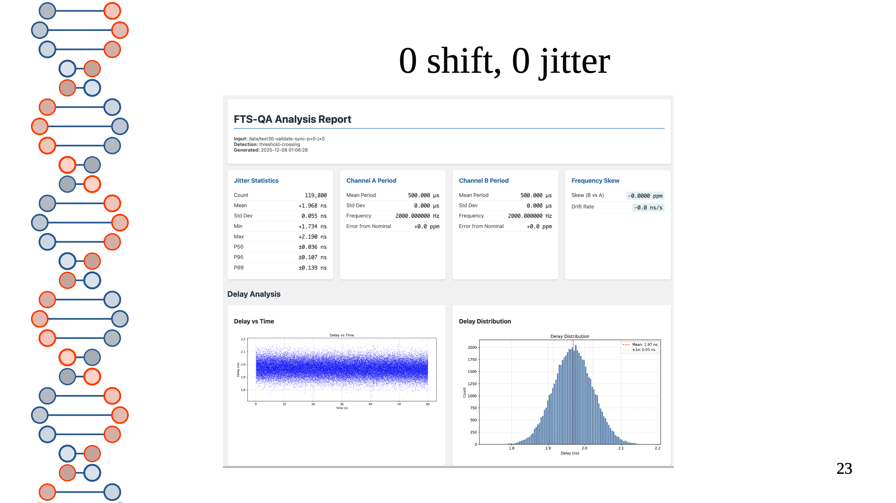
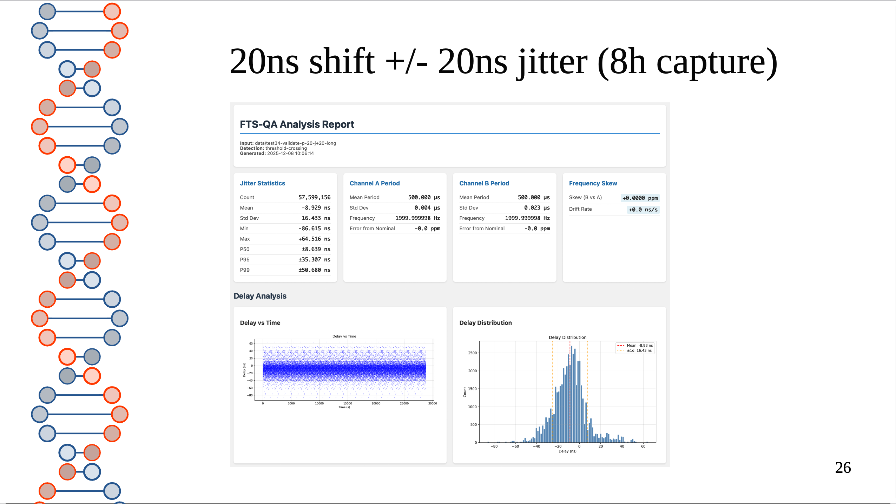

# Performance and Stress Testing FTS (ESP32 Fine Time Sync) Library

## Introduction

Originally, the content of this article was meant to be Part III of FTS QA presentation. A few days ago I have realized I will not have time to finish that presentation in full, for number of reasons. But I felt it would be a pity to bury this project, so I have decided to turn the last part of that FTS QA presentation into an article, to try and hopefully prove that FTS actually works and invite other people use it in their projects.

I will be publishing a draft of FTS QA presentation slides videos, my apologies for the unpolished content:
* Technical design [FTS v0.1 slides](https://github.com/abbbe/fts/blob/main/docs/fts-presa-20251203.pdf) and the [Demo](https://youtu.be/4iP3hrxq6Ro?list=PLaFdGOpzQDVKKY2mbfAGeHgCm-Kj2fClG),
* [FTS QA slides](https://github.com/abbbe/fts/blob/main/docs/fts-qa-presa-draft-20251222.pdf) (unfinished, this article covers the missing parts) and videos: [Intro](https://youtu.be/ig4JJSmVero), [Part I](https://youtu.be/heT7LdVEfXo), [Part II](https://youtu.be/ejwtdzo_Ydw), [Part II's Demos](https://youtu.be/VCuajtiGWCA).
### FTS Goals

In the scope of this project, when speaking of time synchronization, I mean two things:

1. Devices build and maintain a **Clock Relationship Model**, to allow translating between the local and remote clocks,
 2. Devices fine-tunes the period of their local **Disciplined Timers** to make them fire in sync.

FTS makes no attempt to synchronize device clocks with global time as of yet, but it can be done.
### Time Sync Metrics and How They are Measured

The performance of FTS will be judged by measuring relative delays of pulses generated by two different ESP32 S3 SoCs (slaves) aligned to the third one (master) over WiFi FTM. On the photo below, these pulses are visualized on an oscilloscope:

In the new setup pulses are digitized by a lab-grade SDR (Software Defined Radio, basically a high quality ADC with Ethernet output). The picture below show 3x ESP32 S3 chips on the bottom, SDR on the right top:

Shuttle PC (top left) runs a custom Python script which receives SDR data stream and feeds it into TIG stack (Mosquito QTT, Telegraf, InfluxDB, Grafana) over MQTT. Custom Grafana dashboards allow real-time data visualization and long term statistical data analysis.

Below is a snapshot of Grafana dashboard showing distribution of relative delays over one hour:
* average - 14ns,
* standard deviation - 27ns, 
* P99.9% - 99.9ns.
 

### Why Sub-microseconds Time Sync is Difficult

Fine-grained time synchronization between commodity controllers and SoC is notoriously difficult. Most devices lack hardware time-stamping capabilities, leaving software time-stamping as the only source of timing information. This alone introduces tens of microseconds uncertainty.

Should the oscillator be stable, this uncertainty could be averaged out using clever math statistical methods, but crystal oscillators in inexpensive devices drift wildly. During warmup, their frequency can drift wildly (5 PPMs change over 5 minutes):

And even after 8 hours of operation it still jumps around enough to  make sub-microsecond time synchronization difficult:

### Repurposing FTM for Time Sync

Wifi FTM protocol is designed for ranging. It allows FTM initiator and FTM responder devices exchange a series of packets, carrying 4 timestamps taken off their local high-resolution (picoseconds) oscillator, called **MAC clock**.

(Source: https://www.winlab.rutgers.edu/~gruteser/projects/ftm/index.htm).

By subtracting these timestamps the FTM initiator can calculate the time of flight and the distance to the responder.

Unfortunately FTM (at least Espressif's implementation of FTM) was not designed for time synchronization in mind, which creates the following challenges:
* The MAC clock (the counter the FTM timestamps are derived from) is clocked off the same system clock as other timers and counters, but is **not aligned** to any of them,
* Recent ESP IDF v5.5.1 give access to local MAC clock, but only with **1us resolution**,
* The timestamps in FTM packets have a weird **undocumented wrap-around pattern**.

The responder-side timers (T1 and T4) are particularly problematic: it wraps in two ways - naturally due to its 48 bits capacity and additionally when responder's microseconds MAC clock overflows.

Reverse engineering behavior of FTM timers turned out to be an exciting challenge. And figuring out how to align edges of a 1us-resolution MAC clock to a 25ns-resolution MCPWM timer -- even more so. Detailed description of the approach I have ended up with is out of scope of this article. If there is enough interest I can document it too (in the mean time feel free to grep for 'clock_unwrap' and 's_measure_mac_clock_timer_start_offset' in the source code).
## The Architecture of the Test Setup

The new test setup is assembled on two pieces of plastic.

The left panel is mobile, it hosts the master and can be moved around. Green triangle on the left is a directional antenna.

The slaves are mounted on the right panel which stays on the table. The slaves know nothing about each other, independently sync to the master, and send 2kHz pulses to a GPIO pin. The GPIOs are connected (through 100R resistors and green/black 50R coax cables) to the inputs of a lab-grade SDR - Ettus N210 SDRs with Basic RX daughterboard and a GPS-disciplined oscillator.

The architecture of the FTS library itself is described in details in the FTS v0.1 slides, I will not repeat it here, just add a slide with an overview:

For the purposes of testing, it is important to note that the disciplined timer (we use MCPWM module of ESP32 S3) will be configured to send square 2kHz pulses on GPIO. The pulse generation is done in hardware, which should guarantees very low (~10ns) jitter.

The signals are sampled at 10 MHz. Pulse edge is defined (interpolated) as a moment the voltage crosses 0.4V threshold.

To validate this setup I have used it to measure relative delays of signals with a predefined relative delay and jitter. I only show a couple of slides here, which suggest the measurement error is around 10ns. For more details please see the FTS QA presentation.

The first slide shows results of measurements of perfectly synced pulses, generated / captured on a pair of MIMO-synced Ettus N210 SDRs.

We have measured less than 2ns average relative delay (expected 0ns) and some 50ps standard deviation (expected 0ns).

On the second slide we were measuring two signals with deliberate -20ns phase shift and 20ns jitter:
The standard deviation is 16ns (vs 20ns expected) and the average is -8.9ns (vs -20ns). The discrepancy is a bit over 10ns, but still close enough. Please see the FTS QA presentation and video for more tests and details.
## Performance and Stress Test Scenarios

Desktop setup
Look into telemetry
Try running from battery
Reboot the devices, multiple times
Add distance
No line of sight
Move away until it starts to fail
Add walls (+2 floors)
