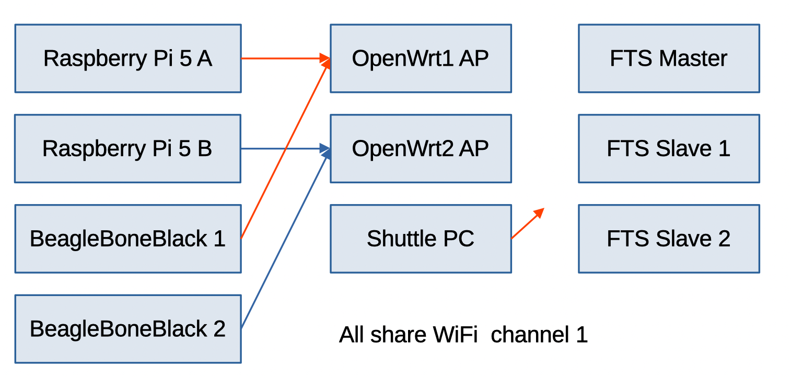

# WiFi Flood Test Setup

## Table of Contents
- TOC
{:toc}

## Introduction

This page documents the setup used for the WiFi flood tests. The goal was to assess the performance of FTS when it shares the radio channel with other stations.

The test setup consists of two wireless networks sharing the wifi channel with the FTS devices. One or both networks can run traffic generator to saturate the radio link.

## Overview of the test setup

Each WiFi network consists of an access point (GL-AR150) and 2 Linux stations (Raspberry Pi 5 / Beaglebone Black + USB Wifi card). Everything sits on same channel #1 of 2.4Ghz WiFi band.

There is also a shuttle PC with two USB Wifi cards and Scapy-based Python script for packet injection (but it turned out to be less useful).



## OpenWRT access points setup

* SSID OpenWrt1, channel 1
	* WAN 192.168.129.227/23
	* LAN 192.168.1.1/24

* SSID OpenWrt2, channel 1
	* WAN 192.168.129.229/23
	* LAN 192.168.2.1/24

WAN ports are not used for testing, but can be plugged into LAN to manage OpenWRTs.
## Stations setup

Stations run Debian Linux.

Their wired ethernet ports are plugged into LAN, we can ssh into Linux hosts to run commands.

### Setup RPI5A to connect to OpenWRT1
```
nmcli connection add \
  type wifi \
  ifname wlan0 \
  con-name openwrt1 \
  ssid OpenWrt1 \
  wifi-sec.key-mgmt wpa-psk \
  wifi-sec.psk "OpenWrt-Karamba" \
  ipv4.method auto \
  ipv4.never-default yes \
  ipv4.ignore-auto-routes yes \
  ipv4.ignore-auto-dns yes \
  ipv6.method ignore
nmcli connection up openwrt1
```

### Setup RPI5B to connect to OpenWRT2
```
nmcli connection add \
  type wifi \
  ifname wlan0 \
  con-name openwrt2 \
  ssid OpenWrt2 \
  wifi-sec.key-mgmt wpa-psk \
  wifi-sec.psk "OpenWrt-Karamba" \
  ipv4.method auto \
  ipv4.never-default yes \
  ipv4.ignore-auto-routes yes \
  ipv4.ignore-auto-dns yes \
  ipv6.method ignore
nmcli connection up openwrt2
```

### Setup bb1 to connect to OpenWrt1
```
nmcli connection add \
  type wifi \
  ifname wlan0 \
  con-name openwrt1 \
  ssid OpenWrt1 \
  wifi-sec.key-mgmt wpa-psk \
  wifi-sec.psk "OpenWrt-Karamba" \
  ipv4.method auto \
  ipv4.never-default yes \
  ipv4.ignore-auto-routes yes \
  ipv4.ignore-auto-dns yes \
  ipv6.method ignore
nmcli connection up openwrt1
```

### Setup bb2 to connect to OpenWrt2
```
nmcli connection add \
  type wifi \
  ifname wlan0 \
  con-name openwrt2 \
  ssid OpenWrt2 \
  wifi-sec.key-mgmt wpa-psk \
  wifi-sec.psk "OpenWrt-Karamba" \
  ipv4.method auto \
  ipv4.never-default yes \
  ipv4.ignore-auto-routes yes \
  ipv4.ignore-auto-dns yes \
  ipv6.method ignore
nmcli connection up openwrt2
```

## Flood Tests

From BB1 flood RPI5A:
```
ssh debian@bb1.local iperf3 -c 192.168.1.232  -u -b 30000000 -t 0
```

From BB2 flood RPI5B:
```
ssh debian@bb2.local iperf3 -c 192.168.2.235  -u -b 30000000 -t 0
```

There is also a packet injection scripts which can be run from shuttle, but it has a marginal impact:
```
sudo .venv/bin/python3 fts-platform/qa/bin/wifi_flood.py -d 0 -i wlx00c0ca7505c3 --channel 1

sudo .venv/bin/python3 fts-platform/qa/bin/wifi_flood.py -d 0 -i wlx00c0ca6d0c4b --channel 1
```
